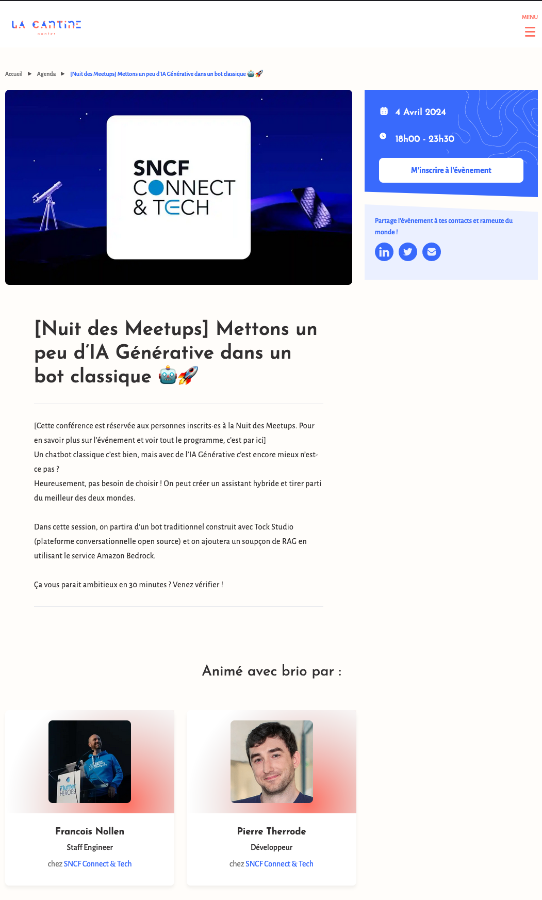
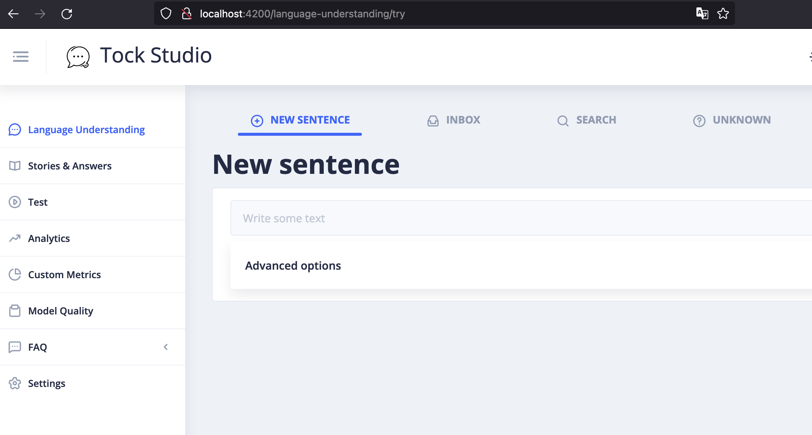
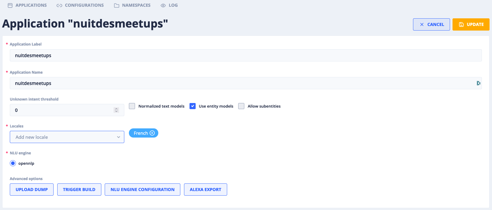
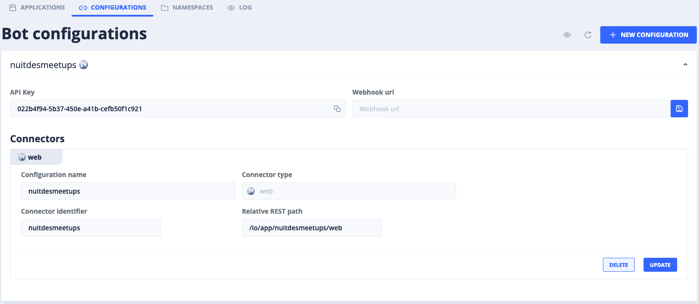

# [Nuit des Meetups] Mettons un peu d’IA Générative dans un bot classique 🤖🚀

Ce projet github est issue de la présentation faite par François Nollen et Pierre Therrode, pour la nuit des meetups 
du 4 avril 2024, avec comme sujet : _[[Nuit des Meetups] Mettons un peu d’IA Générative dans un bot classique 🤖🚀](https://www.lacantine.co/agenda/event/04-04-2024-nuitdesmeetupsmettonsunpeudiagnrativedansunbotclassique/)_





## Sommaire

- [Prérequis](#prérequis)
- [Lancer l'image Docker](#lancer-limage-docker)
- [Lancer l'espace admin depuis votre IDE](#lancer-lespace-admin-depuis-votre-ide)
- [Créer votre 1er Application](#créer-votre-1er-application)
- [Créer votre 1er connecteur web](#créer-votre-1er-connecteur-web)
- [Lancer le bot](#lancer-le-bot)
- [Se brancher à l'agent Amazon Bedrock](#se-brancher-à-lagent-amazon-bedrock)
- [Interroger le bot](#interroger-le-bot)


## Prérequis
Dans votre terminal, faire un git clone du projet Tock Studio :

```bash
git clone git@github.com:theopenconversationkit/tock.git
```
puis un git clone du projet Tock Docker :

```bash
git clone https://github.com/theopenconversationkit/tock-docker.git
```

## Lancer l'image Docker
Dans le répertoire tock-docker, lisser la section [Connect to the mongo database from an IDE](https://github.com/theopenconversationkit/tock-docker?tab=readme-ov-file#connect-to-the-mongo-database-from-an-ide), puis lancer la commande suivante :

```bash
docker-compose -f docker-compose-mongo-only.yml up
```

## Lancer l'espace admin depuis votre IDE

Dans votre IDE (ici ce sera avec IntelliJ) ouvrir le projet Tock Studio. Aller dans la
section [bot > admin > web](https://github.com/theopenconversationkit/tock/tree/master/bot/admin/web) et suivre les 
instructions du README (section **Merge sources to target folder**).

Une fois les actions préparatoires effectuées avec un serveur lancé, il faut lancer les programmes suivants :

* botAdmin
* NlpService
* Duckling


Si tout est bon, vous devriez avoir ce rendu sur l'adresse suivante : http://localhost:4200



## Créer votre 1er Application
Dans la section Settings, cliquez sur le bouton "+ NEW APPLICATION". Remplisez les champs requis comme dans l'exemple 
suivant :



## Créer votre 1er connecteur web

Dans la section Settings > CONFIGURATIONS, cliquez sur le bouton "+ NEW CONFIGURATION" pour créer, comme dans
l'exemple suivant un connecteur web avec comme endpoint io/app/nuitdesmeetups/web



## Lancer le bot

Dans ce projet et depuis votre terminal faite un mvn clean install, puis lancer le projet "LaNuitDesMeetUps".

## Se brancher à l'agent Amazon Bedrock

Dans ce projet, allez dans le dossier kbAgent et suivez les instructions du README

## Interroger le bot

Dans ce projet et une fois toutes les étapes précédement réalisées, vous pouvez ouvrir les fichiers index.html depuis
votre navigateur et commmencer à dialoguer avec le bot.


